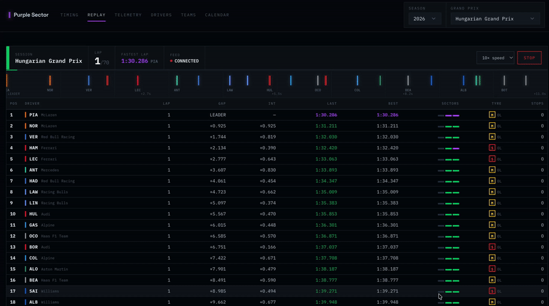
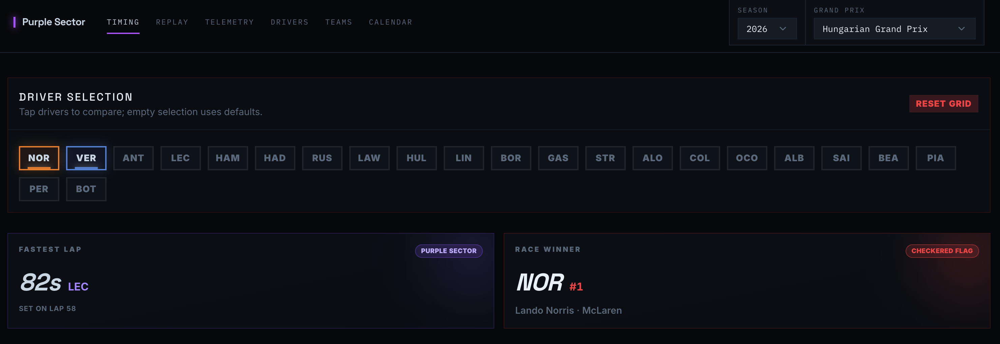
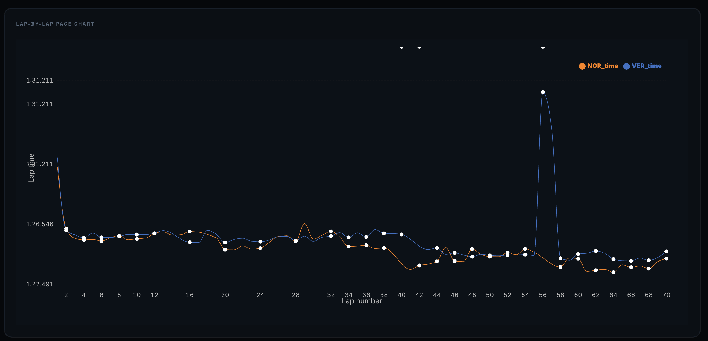
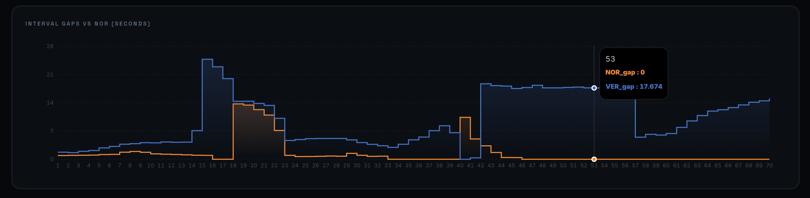
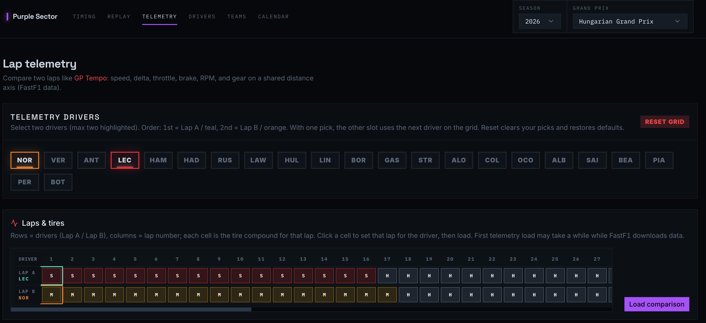
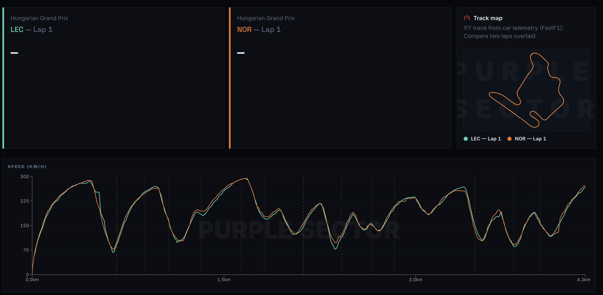
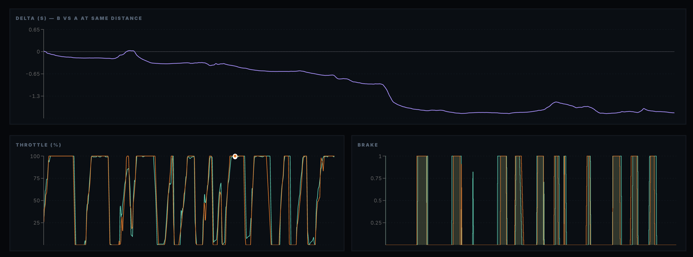
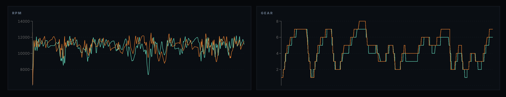
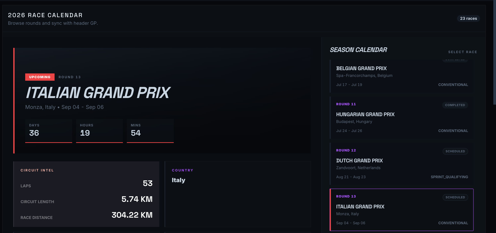
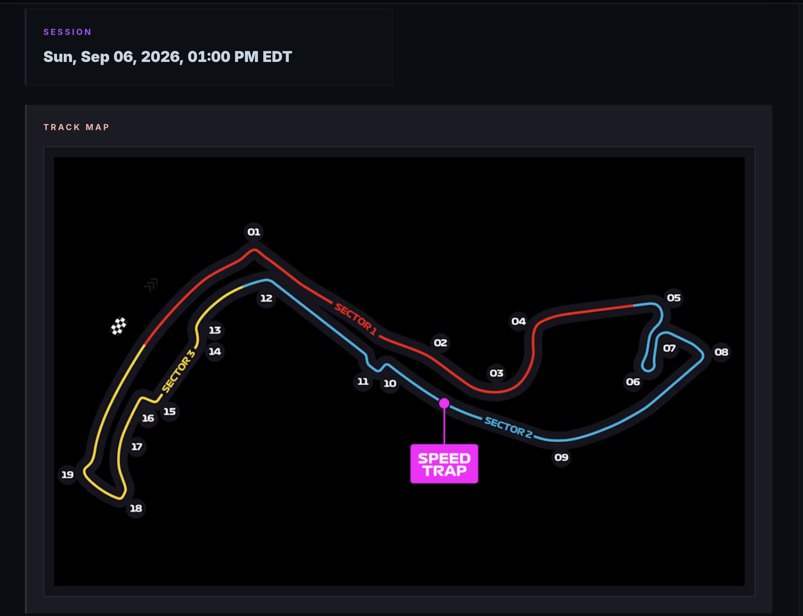

# Purple Sector

Formula 1 race analytics — lap timing, tyre strategy and full car telemetry,
with a Kafka pipeline that replays a finished race as a live timing feed.

<p align="center">
  
</p>

Purple is the FIA colour for the fastest sector in a session — the whole
interface is built around that one convention: purple for fastest, green for
a personal best, yellow for slower. If you've watched a broadcast timing
screen, there's nothing new to learn here.

---

## Why a replay engine, not a live feed

Formula 1 runs roughly twenty-four race weekends a year. A pipeline built for
genuinely live data would sit idle the other 340-odd days — which makes it a
bad thing to put a demo link in front of anyone. Purple Sector replays a
*completed* race through the same infrastructure a live feed would use: the
same Kafka topics, the same stateful consumer, the same WebSocket fan-out,
just running on a clock you control instead of the actual clock.

```
FastAPI ──▶ Redis (cache-aside, distributed lock)
   │
   ▼
Kafka / Redpanda ──▶ stateful consumer ──▶ Redis pub/sub ──▶ WebSocket ──▶ browser
(partitioned by      (derives standings,
 driver, for           gaps, tyre age)
 ordering)
```

Full write-up of both the caching layer and the streaming pipeline is in
[`ARCHITECTURE.md`](ARCHITECTURE.md).

---

## Screenshots

### Timing tower & replay setup
Position, gap, interval and fastest-lap tracking for every driver, styled
after an FIA timing screen rather than a generic dashboard.



### Pace and gap analysis
Lap-by-lap pace comparison and rolling interval gap between any two drivers,
with pit stops visible as step changes in the gap.

<p float="left">
  
  
</p>

### Telemetry — driver and lap selection
Pick two drivers and any lap each; tyre compound per lap is shown as a grid
so you can line up direct comparisons before loading the trace.



### Telemetry — track map traced from real coordinates
The circuit outline is not a stock image — it's traced from the same X/Y
telemetry FastF1 returns for the lap, overlaid with a live speed trace.



### Telemetry — delta, throttle, brake, RPM, gear
Full channel breakdown between two laps on a shared distance axis, so a
braking point or throttle difference lines up exactly where it happened on
track.

<p float="left">
  
</p>
<p float="left">
  
</p>

### Calendar
Season schedule with a live countdown to the next session and circuit
statistics for the selected round.



### Circuit intelligence
Corner-by-corner circuit map with sector boundaries and speed trap location,
generated from FastF1's circuit info for the session.



---

## Stack

**Backend** — FastAPI, FastF1, pandas, Redis (cache-aside + distributed lock),
Kafka/Redpanda (`aiokafka`), WebSockets.

**Frontend** — React 19, Vite, Tailwind, shadcn/ui, Recharts, TanStack Query.

**Infra** — Docker Compose: `redis`, `redpanda`, `console` (broker UI),
`backend`, `consumer` (independently scalable stream processor).

---

## Running it

```bash
cp backend/.env.example backend/.env
cp frontend/.env.example frontend/.env

docker compose up --build      # redis, redpanda, api, consumer
cd frontend && bun install && bun run dev
```

| URL                          | What                     |
|-------------------------------|--------------------------|
| http://localhost:5173         | App                      |
| http://localhost:8000/docs    | API reference            |
| http://localhost:8080         | Redpanda console         |

Trigger a replay:

```bash
curl -X POST "localhost:8000/replay/2024/Italian%20Grand%20Prix?speed=10"
```

Then open **Race Replay** in the app, or watch the raw stream:

```bash
docker compose exec redpanda rpk topic consume f1.timing
```

---

## Measured, not claimed

Caching a full race analytics payload behind Redis with a distributed
compute lock (so concurrent cold requests never duplicate a multi-second
pandas job):

| | |
|---|---|
| Uncached (cold FastF1 + pandas) | ~1.3s |
| Cached (Redis hit) | **~69ms** |

Full architecture notes, including why the lock uses a token + Lua release
instead of a bare `DEL`, are in [`ARCHITECTURE.md`](ARCHITECTURE.md).

---

*Purple Sector is an independent project built on public FastF1 data. Not
affiliated with Formula 1, the FIA, or any team.*
